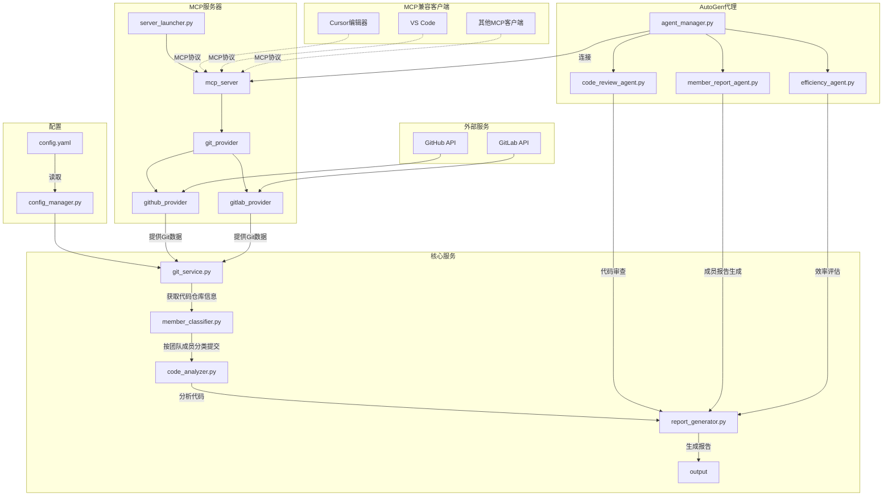
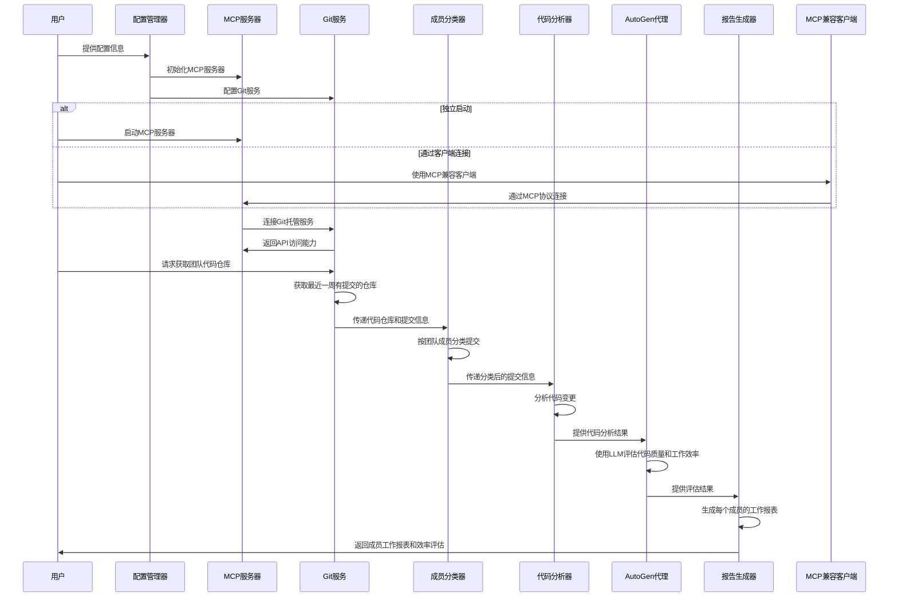
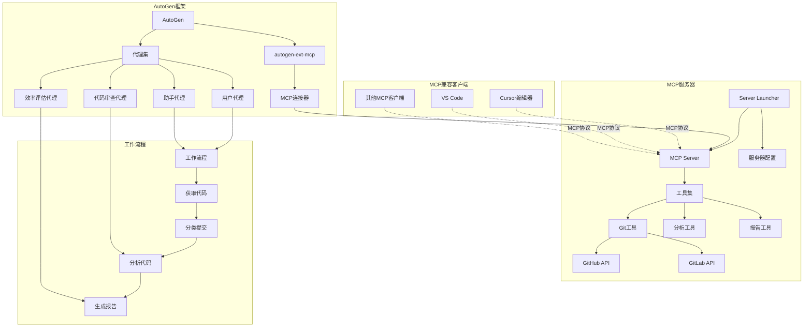
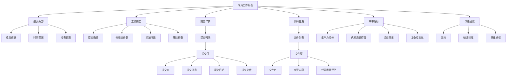
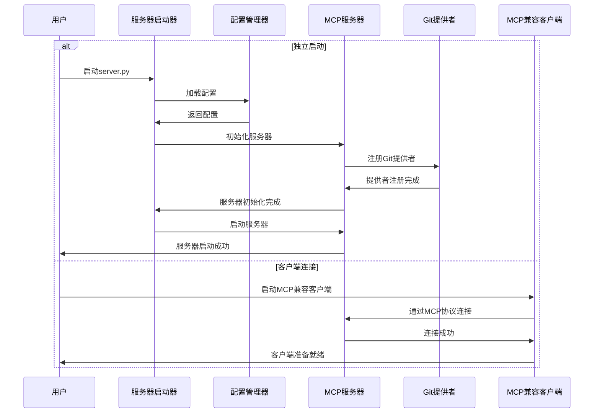
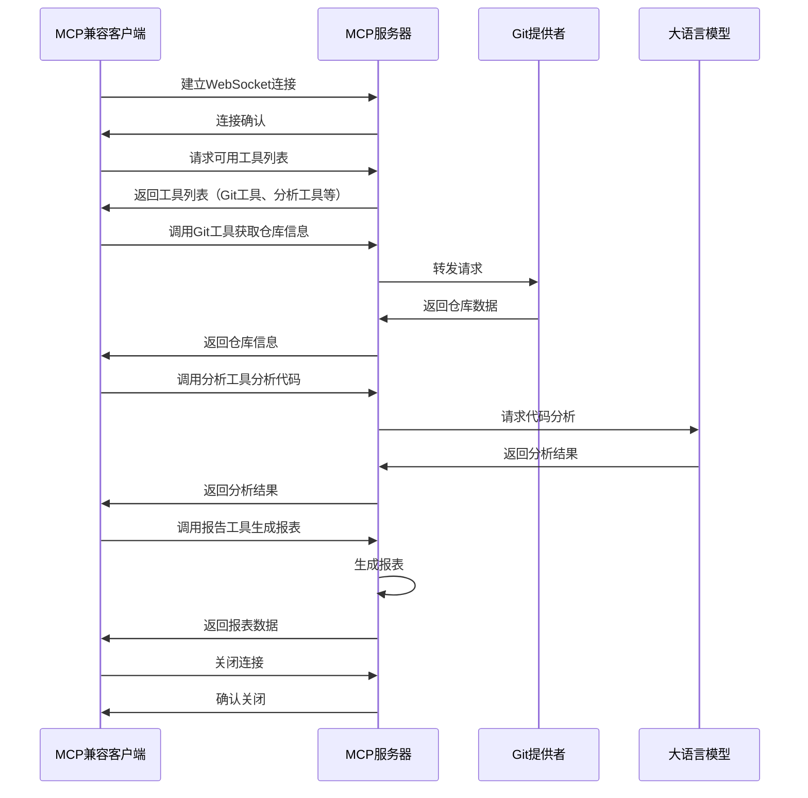

# 工作评估系统架构

本文档包含工作评估系统的架构图表，用于从Git仓库托管服务获取团队代码提交并进行分析。

## 项目结构图

```mermaid
graph TD
    A[工作评估系统] --> B[核心模块]
    A --> C[MCP服务器模块]
    A --> D[AutoGen代理模块]
    A --> E[文档]
    A --> F[测试]
    
    B --> B1[git_service.py]
    B --> B2[code_analyzer.py]
    B --> B3[report_generator.py]
    B --> B4[config_manager.py]
    B --> B5[member_classifier.py]
    
    C --> C1[mcp_server.py]
    C --> C2[git_provider.py]
    C --> C3[github_provider.py]
    C --> C4[gitlab_provider.py]
    C --> C5[server_launcher.py]
    
    D --> D1[agent_manager.py]
    D --> D2[code_review_agent.py]
    D --> D3[member_report_agent.py]
    D --> D4[efficiency_agent.py]
    
    E --> E1[README.md]
    E --> E2[installation.md]
    E --> E3[configuration.md]
    E --> E4[api_reference.md]
    E --> E5[examples.md]
    E --> E6[mcp_protocol.md]
    
    F --> F1[test_git_service.py]
    F --> F2[test_code_analyzer.py]
    F --> F3[test_report_generator.py]
    F --> F4[test_mcp_server.py]
    F --> F5[test_agents.py]
    F --> F6[test_member_classifier.py]
```

## 组件架构图

```mermaid
flowchart TD
    subgraph 配置
        config[config.yaml] --> |读取| config_manager
    end
    
    subgraph MCP服务器
        mcp_server --> git_provider
        git_provider --> github_provider
        git_provider --> gitlab_provider
        server_launcher[server_launcher.py] --> mcp_server
    end
    
    subgraph 核心服务
        config_manager[config_manager.py] --> git_service
        git_service[git_service.py] --> |获取代码仓库信息| member_classifier
        member_classifier[member_classifier.py] --> |按团队成员分类提交| code_analyzer
        code_analyzer[code_analyzer.py] --> |分析代码| report_generator
        report_generator[report_generator.py] --> |生成报告| output
    end
    
    subgraph AutoGen代理
        agent_manager[agent_manager.py] --> code_review_agent
        agent_manager --> member_report_agent
        agent_manager --> efficiency_agent
        code_review_agent[code_review_agent.py] --> |代码审查| report_generator
        member_report_agent[member_report_agent.py] --> |成员报告生成| report_generator
        efficiency_agent[efficiency_agent.py] --> |效率评估| report_generator
    end
    
    subgraph 外部服务
        github[GitHub API] --> github_provider
        gitlab[GitLab API] --> gitlab_provider
    end
    
    subgraph MCP兼容客户端
        cursor[Cursor编辑器] -.-> |MCP协议| mcp_server
        vscode[VS Code] -.-> |MCP协议| mcp_server
        other_clients[其他MCP客户端] -.-> |MCP协议| mcp_server
    end
    
    github_provider --> |提供Git数据| git_service
    gitlab_provider --> |提供Git数据| git_service
    
    agent_manager --> |连接| mcp_server
```

## 数据流程图

```mermaid
sequenceDiagram
    participant User as 用户
    participant Config as 配置管理器
    participant MCP as MCP服务器
    participant Git as Git服务
    participant Classifier as 成员分类器
    participant Analyzer as 代码分析器
    participant Agents as AutoGen代理
    participant Report as 报告生成器
    participant Client as MCP兼容客户端
    
    User->>Config: 提供配置信息
    Config->>MCP: 初始化MCP服务器
    Config->>Git: 配置Git服务
    
    alt 独立启动
        User->>MCP: 启动MCP服务器
    else 通过客户端连接
        User->>Client: 使用MCP兼容客户端
        Client->>MCP: 通过MCP协议连接
    end
    
    MCP->>Git: 连接Git托管服务
    Git->>MCP: 返回API访问能力
    
    User->>Git: 请求获取团队代码仓库
    Git->>Git: 获取最近一周有提交的仓库
    Git->>Classifier: 传递代码仓库和提交信息
    
    Classifier->>Classifier: 按团队成员分类提交
    Classifier->>Analyzer: 传递分类后的提交信息
    
    Analyzer->>Analyzer: 分析代码变更
    Analyzer->>Agents: 提供代码分析结果
    
    Agents->>Agents: 使用LLM评估代码质量和工作效率
    Agents->>Report: 提供评估结果
    
    Report->>Report: 生成每个成员的工作报表
    Report->>User: 返回成员工作报表和效率评估
```

## 项目文件结构

```mermaid
graph TD
    Root[工作评估系统] --> Core[core/]
    Root --> MCP[mcp_server/]
    Root --> Agents[agents/]
    Root --> Docs[docs/]
    Root --> Tests[tests/]
    Root --> Config[config/]
    Root --> main.py
    Root --> server.py
    Root --> requirements.txt
    Root --> README.md
    
    Core --> git_service.py
    Core --> member_classifier.py
    Core --> code_analyzer.py
    Core --> report_generator.py
    Core --> config_manager.py
    
    MCP --> mcp_server.py
    MCP --> git_provider.py
    MCP --> server_launcher.py
    MCP --> providers[providers/]
    providers --> github_provider.py
    providers --> gitlab_provider.py
    
    Agents --> agent_manager.py
    Agents --> code_review_agent.py
    Agents --> member_report_agent.py
    Agents --> efficiency_agent.py
    
    Docs --> installation.md
    Docs --> configuration.md
    Docs --> api_reference.md
    Docs --> examples.md
    Docs --> mcp_protocol.md
    
    Tests --> test_git_service.py
    Tests --> test_member_classifier.py
    Tests --> test_code_analyzer.py
    Tests --> test_report_generator.py
    Tests --> test_mcp_server.py
    Tests --> test_agents.py
    
    Config --> config.yaml
    Config --> templates[templates/]
    templates --> member_report_template.md
    templates --> efficiency_template.md
```

## 配置文件结构

```mermaid
graph TD
    Config[config.yaml] --> General[general]
    Config --> GitProviders[git_providers]
    Config --> TeamMembers[team_members]
    Config --> Agents[agents]
    Config --> Reports[reports]
    Config --> Server[server]
    
    General --> ProjectName[project_name]
    General --> TimeRange[time_range: 7]
    General --> OutputDir[output_dir]
    
    GitProviders --> GitHub[github]
    GitProviders --> GitLab[gitlab]
    
    GitHub --> GitHubToken[token]
    GitHub --> GitHubOrg[organization]
    GitHub --> GitHubRepos[repositories]
    
    GitLab --> GitLabToken[token]
    GitLab --> GitLabGroup[group]
    GitLab --> GitLabProjects[projects]
    
    TeamMembers --> Member1[member1]
    TeamMembers --> Member2[member2]
    TeamMembers --> MemberN[member_n]
    
    Member1 --> Member1Name[name]
    Member1 --> Member1Email[email]
    Member1 --> Member1Username[username]
    
    Agents --> LLMProvider[llm_provider]
    Agents --> ModelName[model_name]
    Agents --> APIKey[api_key]
    
    Reports --> Format[format]
    Reports --> IncludeMetrics[include_metrics]
    Reports --> TemplateDir[template_dir]
    Reports --> IndividualReports[individual_reports: true]
    
    Server --> Host[host: localhost]
    Server --> Port[port: 8000]
    Server --> Debug[debug: false]
    Server --> AllowedOrigins[allowed_origins]
```

## MCP服务器与AutoGen集成架构

```mermaid
flowchart TD
    subgraph MCP服务器
        mcp_server[MCP Server] --> tools[工具集]
        tools --> git_tool[Git工具]
        tools --> analysis_tool[分析工具]
        tools --> report_tool[报告工具]
        
        git_tool --> github_api[GitHub API]
        git_tool --> gitlab_api[GitLab API]
        
        server_launcher[Server Launcher] --> mcp_server
        server_launcher --> server_config[服务器配置]
    end
    
    subgraph AutoGen框架
        autogen[AutoGen] --> agents[代理集]
        agents --> user_proxy[用户代理]
        agents --> assistant[助手代理]
        agents --> code_reviewer[代码审查代理]
        agents --> efficiency_evaluator[效率评估代理]
        
        autogen --> autogen_ext_mcp[autogen-ext-mcp]
        autogen_ext_mcp --> mcp_connector[MCP连接器]
    end
    
    mcp_connector --> mcp_server
    
    subgraph 工作流程
        workflow[工作流程] --> fetch[获取代码]
        fetch --> classify[分类提交]
        classify --> analyze[分析代码]
        analyze --> generate[生成报告]
    end
    
    subgraph MCP兼容客户端
        cursor[Cursor编辑器] -.-> |MCP协议| mcp_server
        vscode[VS Code] -.-> |MCP协议| mcp_server
        other_clients[其他MCP客户端] -.-> |MCP协议| mcp_server
    end
    
    user_proxy --> workflow
    assistant --> workflow
    code_reviewer --> analyze
    efficiency_evaluator --> generate
```

## 成员工作报表结构

```mermaid
graph TD
    Report[成员工作报表] --> Header[报表头部]
    Report --> Summary[工作摘要]
    Report --> Commits[提交详情]
    Report --> CodeChanges[代码变更]
    Report --> Metrics[效率指标]
    Report --> Feedback[改进建议]
    
    Header --> MemberInfo[成员信息]
    Header --> TimeRange[时间范围]
    Header --> ReportDate[报表日期]
    
    Summary --> CommitCount[提交数量]
    Summary --> FilesChanged[修改文件数]
    Summary --> LinesAdded[添加行数]
    Summary --> LinesRemoved[删除行数]
    
    Commits --> CommitList[提交列表]
    CommitList --> CommitItem[提交项]
    CommitItem --> CommitID[提交ID]
    CommitItem --> CommitMessage[提交消息]
    CommitItem --> CommitDate[提交日期]
    CommitItem --> CommitFiles[提交文件]
    
    CodeChanges --> FileList[文件列表]
    FileList --> FileItem[文件项]
    FileItem --> FileName[文件名]
    FileItem --> FileChanges[变更内容]
    FileItem --> CodeQuality[代码质量评估]
    
    Metrics --> ProductivityScore[生产力得分]
    Metrics --> CodeQualityScore[代码质量得分]
    Metrics --> CommitFrequency[提交频率]
    Metrics --> ComplexityChange[复杂度变化]
    
    Feedback --> StrengthPoints[优势]
    Feedback --> ImprovementAreas[改进领域]
    Feedback --> Recommendations[具体建议]
```

## MCP服务器启动流程

```mermaid
sequenceDiagram
    participant User as 用户
    participant Launcher as 服务器启动器
    participant Config as 配置管理器
    participant Server as MCP服务器
    participant Provider as Git提供者
    participant Client as MCP兼容客户端
    
    alt 独立启动
        User->>Launcher: 启动server.py
        Launcher->>Config: 加载配置
        Config->>Launcher: 返回配置
        Launcher->>Server: 初始化服务器
        Server->>Provider: 注册Git提供者
        Provider->>Server: 提供者注册完成
        Server->>Launcher: 服务器初始化完成
        Launcher->>Server: 启动服务器
        Server->>User: 服务器启动成功
    else 客户端连接
        User->>Client: 启动MCP兼容客户端
        Client->>Server: 通过MCP协议连接
        Server->>Client: 连接成功
        Client->>User: 客户端准备就绪
    end
```

## MCP协议通信流程

```mermaid
sequenceDiagram
    participant Client as MCP兼容客户端
    participant Server as MCP服务器
    participant Provider as Git提供者
    participant LLM as 大语言模型
    
    Client->>Server: 建立WebSocket连接
    Server->>Client: 连接确认
    
    Client->>Server: 请求可用工具列表
    Server->>Client: 返回工具列表（Git工具、分析工具等）
    
    Client->>Server: 调用Git工具获取仓库信息
    Server->>Provider: 转发请求
    Provider->>Server: 返回仓库数据
    Server->>Client: 返回仓库信息
    
    Client->>Server: 调用分析工具分析代码
    Server->>LLM: 请求代码分析
    LLM->>Server: 返回分析结果
    Server->>Client: 返回分析结果
    
    Client->>Server: 调用报告工具生成报表
    Server->>Server: 生成报表
    Server->>Client: 返回报表数据
    
    Client->>Server: 关闭连接
    Server->>Client: 确认关闭
```